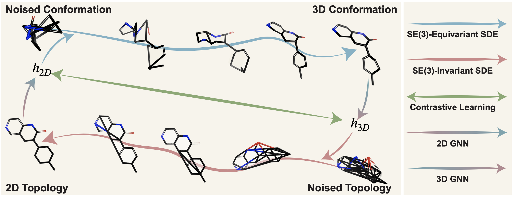

# A Group Symmetric Stochastic Differential Equation Model for Molecule Multi-modal Pretraining

**ICML 2023**

Shengchao Liu<sup>+</sup>, Weitao Du<sup>+</sup>, Zhiming Ma, Hongyu Guo, Jian Tang

<sup>+</sup> Equal contribution

[[Project Page](https://chao1224.github.io/MoleculeSDE)]
[[Paper](https://proceedings.mlr.press/v202/liu23h.html)]
[[ArXiv](https://arxiv.org/abs/2305.18407)]
[[Checkpoints on HuggingFace](https://huggingface.co/chao1224/MoleculeSDE/tree/main)]

<p align="center">
   
</p>

- MoleculeSDE is GraphMVPv2, follow-up of GraphMVP
- It includes two components:
    - Contrastive learning
    - Generative learning:
        - One 2D->3D diffusion model. Frame-based SE(3)-equivariant and reflection anti-symmetric model
        - One 3D->2D diffusion model. SE(3)-invariant.

All the pretrained checkpoints are available on [this HuggingFace link](https://huggingface.co/chao1224/MoleculeSDE/tree/main).
You can find detailed mapping between checkpoints and tables in file `README_checkpoints.md`.

<p align="left">
   
</p>


## Environments
```bash
conda create -n Geom3D python=3.7
conda activate Geom3D
conda install -y -c rdkit rdkit
conda install -y numpy networkx scikit-learn
conda install -y -c conda-forge -c pytorch pytorch=1.9.1
conda install -y -c pyg -c conda-forge pyg=2.0.2
pip install ogb==1.2.1

pip install sympy

pip install ase  # for SchNet

pip intall -e .
```

## Datasets

- For PCQM4Mv2 (pretraining) dataset
  - Download the dataset from [PCQM4Mv2 website](https://ogb.stanford.edu/docs/lsc/pcqm4mv2/) under folder `data/PCQM4Mv2/raw`:
    ```
      .
    ├── data
    │   └── PCQM4Mv2
    │       └── raw
    │           ├── data.csv
    │           ├── data.csv.gz
    │           ├── pcqm4m-v2-train.sdf
    │           └── pcqm4m-v2-train.sdf.tar.gz
    ```
  - Then run `examples/generate_PCQM4Mv2.py`.
- For QM9, it is automatically downloaded in pyg class. The default path is `data/molecule_datasets/QM9`.
- For MD17, it is automatically downloaded in pyg class. The default path is `data/MD17`.
- For MoleculeNet, please follow [GraphMVP instructions](https://github.com/chao1224/GraphMVP). The dataset structure is:
  ```
    .
  ├── data
  │   ├── molecule_datasets
  │   │   ├── bace
  │   │   │   ├── BACE_README
  │   │   │   └── raw
  │   │   │       └── bace.csv
  │   │   ├── bbbp
  ...............
  ```

## Pretraining

A quick demo on pretraining is:
```
cd examples

python pretrain_MoleculeSDE.py \
--verbose --input_data_dir=../data --dataset=PCQM4Mv2 \
--model_3d=SchNet \
--lr=1e-4 --epochs=50 --num_workers=0 --batch_size=256 --SSL_masking_ratio=0 --gnn_3d_lr_scale=0.1 --dropout_ratio=0 --graph_pooling=mean --emb_dim=300 --epochs=1 \
--SDE_coeff_contrastive=1 --CL_similarity_metric=EBM_node_dot_prod --T=0.1 --normalize --SDE_coeff_contrastive_skip_epochs=0 \
--SDE_coeff_generative_2Dto3D=1 --SDE_2Dto3D_model=SDEModel2Dto3D_02 --SDE_type_2Dto3D=VE --use_extend_graph \
--SDE_coeff_generative_3Dto2D=1 --SDE_3Dto2D_model=SDEModel3Dto2D_node_adj_dense --SDE_type_3Dto2D=VE --noise_on_one_hot \
--output_model_dir=[MODEL_DIR]
```

**Notice** that the `[MODEL_DIR]` is where you are going to save your models/checkpoints.

## Downstream

The downstream scripts can be found under the `examples` folder. Below we illustrate few simple examples.
- `finetune_MoleculeNet.py`:
  ```
  python finetune_MoleculeNet.py \
  --dataset=tox21 \
  --input_model_file=[MODEL_DIR]/model_complete.pth
  ```
- `finetune_QM9.py`: 
  ```
  python finetune_QM9.py \
  --dataset=QM9 --task=gap \
  --model_3d=SchNet \
  --input_model_file=[MODEL_DIR]/model_complete.pth
  ```
- `finetune_MD17.py`: 
  ```
  python finetune_MD17.py \
  --dataset=MD17 --task=aspirin \
  --model_3d=SchNet \
  --input_model_file=[MODEL_DIR]/model_complete.pth
  ```

## Cite Us

Feel free to cite this work if you find it useful to you!

```
@inproceedings{liu2023group,
  title={A group symmetric stochastic differential equation model for molecule multi-modal pretraining},
  author={Liu, Shengchao and Du, Weitao and Ma, Zhi-Ming and Guo, Hongyu and Tang, Jian},
  booktitle={International Conference on Machine Learning},
  pages={21497--21526},
  year={2023},
  organization={PMLR}
}
```
